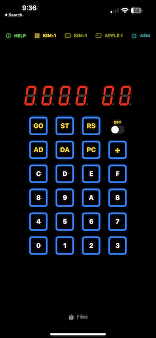
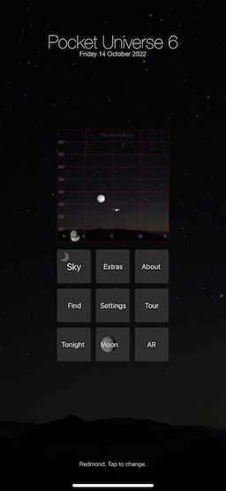

- 👋 Hi, I’m @GrantMeStrength aka jken@microsoft.com aka John Kennedy.
- 👀 I’m interested in programming languages, documentation, iOS apps, old computers, and hardware projects.
- 🌱 I’m currently learning Rust and Lisp.
- 📫 You can find me on ,   and 

My current favorite projects are on the iOS App Store: 

 .
