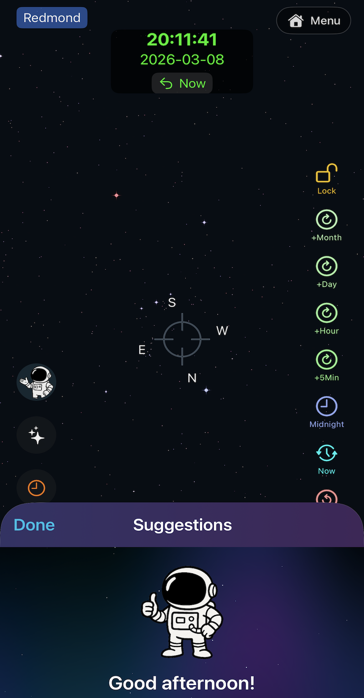
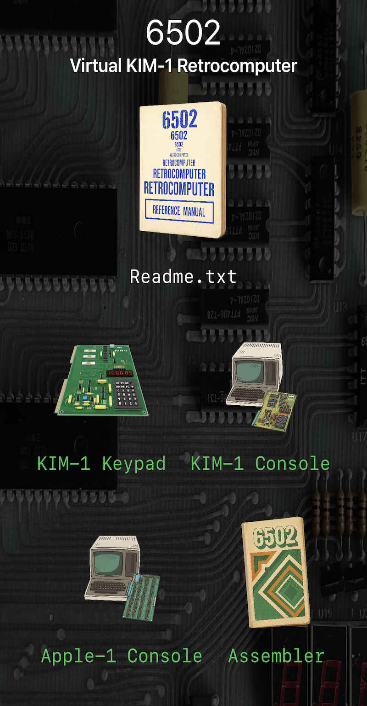
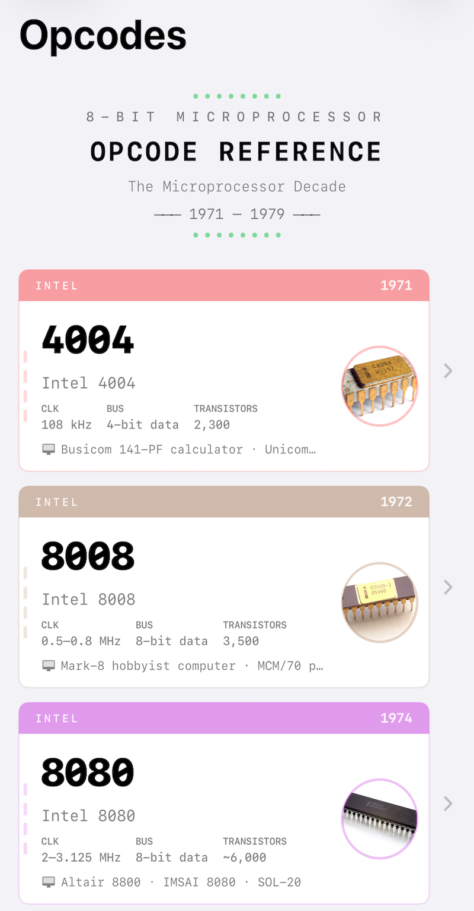
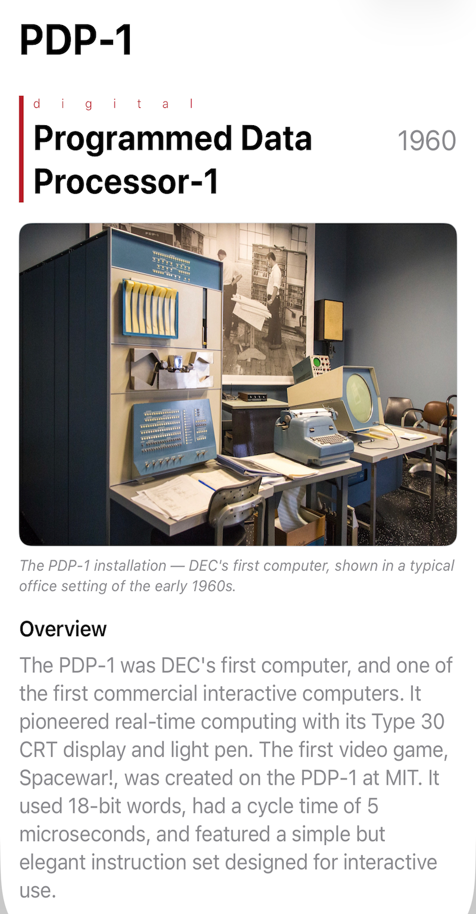

# Hi, I'm John Kennedy 👋

I'm in technical writing at Microsoft and an indie iOS developer. I'm passionate about programming languages, documentation, retro computing, astronomy, and hardware projects.

Outside of work, I build and maintain a catalog of iOS and visionOS apps under [**Craic Design**](https://www.craicdesign.com) — covering everything from astronomy guides to retro-computing emulators and puzzle games.

📫 Find me on  and 

---

### Featured Apps

🔗 See all apps at [craicdesign.com](https://www.craicdesign.com)

### Some Notable Repos

* [Retro computing](https://github.com/GrantMeStrength/retro)
* [Small-scale robots with AI](https://github.com/GrantMeStrength/robot)
* [ThinkFeed learn-scrolling app](https://github.com/GrantMeStrength/ThinkFeed)
* [ENIAC on VisionPro](https://github.com/GrantMeStrength/ENIAC)
* [6502 MCP Server](https://github.com/GrantMeStrength/6502MCP)
