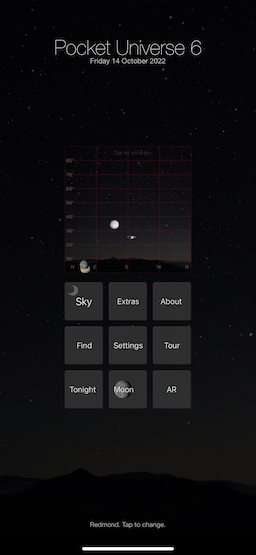
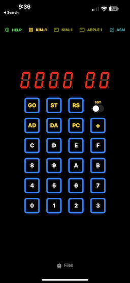

# Hi, I'm John Kennedy 👋

I'm a software engineer at Microsoft and an indie iOS developer. I'm passionate about programming languages, documentation, retro computing, astronomy, and hardware projects.

Outside of work, I build and maintain a catalog of iOS and visionOS apps under [**Craic Design**](https://www.craicdesign.com) — covering everything from astronomy guides to retro-computing emulators and puzzle games.

🌱 Currently learning Rust and Lisp

📫 Find me on  and 

---

### Featured Apps

🔗 See all apps at [craicdesign.com](https://www.craicdesign.com)
